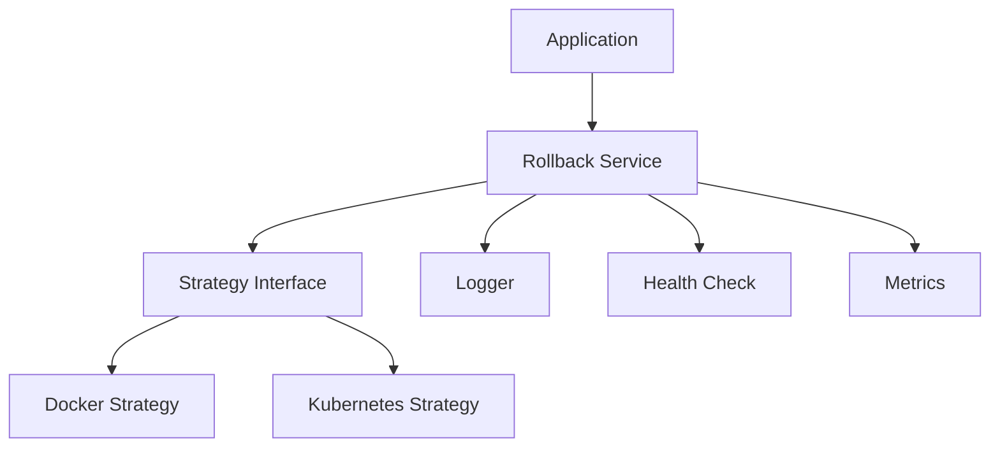

# Stable Galaxy

A robust Go library for managing application rollbacks across different deployment platforms.

## Features

- Automated rollback on failure detection
- Support for multiple deployment platforms (Docker, Kubernetes)
- Configurable retry mechanisms
- Pre and post-rollback hooks
- Structured logging
- Version validation
- Health checks

## Installation

```bash
go get github.com/BaderEddineBenhirt/stable-galaxy
```

## Quick Start

```go
package main

import (
    "github.com/BaderEddineBenhirt/stable-galaxy/pkg/deployment"
    "github.com/BaderEddineBenhirt/stable-galaxy/pkg/rollback"
    "github.com/BaderEddineBenhirt/stable-galaxy/pkg/logging"
)

func main() {
    logger := logging.NewLogger("info", false)

    dockerConfig := deployment.DockerConfig{
        ServiceName: "myapp",
        Registry:   "registry.example.com",
    }
    dockerStrat := deployment.NewDockerStrategy(dockerConfig)

    rollbackCfg := rollback.DefaultConfig()
    rollbackSvc := rollback.NewService(rollbackCfg, dockerStrat, logger)

    rollbackSvc.RegisterVersion("v1.0.0")
    rollbackSvc.RegisterVersion("v1.1.0")

    err := rollbackSvc.Rollback("v1.1.0")
    if err != nil {
        logger.Error().Err(err).Msg("Rollback failed")
    }
}
```

## Kubernetes Example

```go

clientset := setupKubernetesClient()


k8sConfig := deployment.KubernetesConfig{
    Namespace:  "default",
    Deployment: "myapp",
}
k8sStrat := deployment.NewKubernetesStrategy(clientset, k8sConfig)


rollbackSvc := rollback.NewService(rollbackCfg, k8sStrat, logger)
```

## Configuration

### RollbackConfig Options
```go
type RollbackConfig struct {
    MaxAttempts      int
    BackoffDuration  time.Duration
    Timeout          time.Duration
    DryRun           bool
    PreRollbackHook  func() error
    PostRollbackHook func() error
    OnFailureHook    func(error)
    ValidateVersion  func(string) bool
    MetricsEnabled   bool
    HealthCheckURL   string
    HealthTimeout    time.Duration
}
```

## Architecture



## License

MIT License